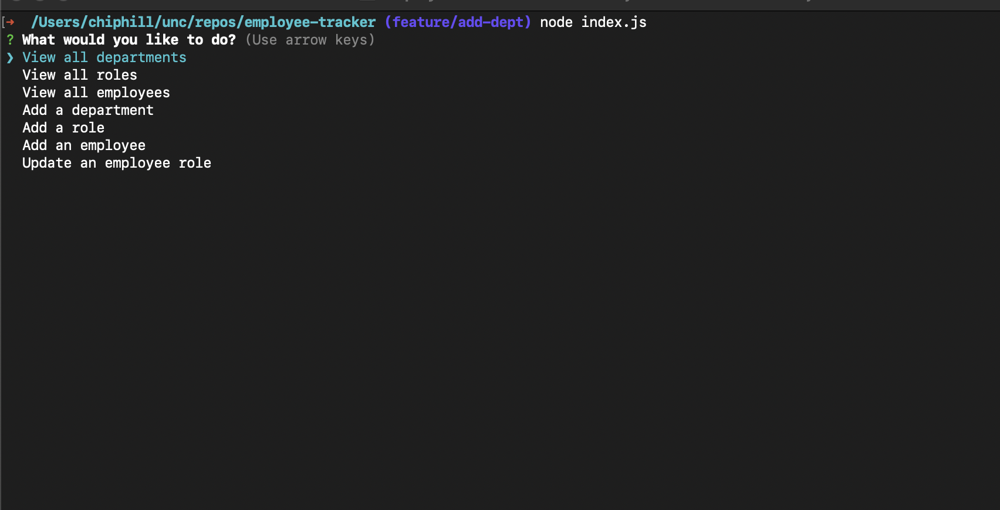
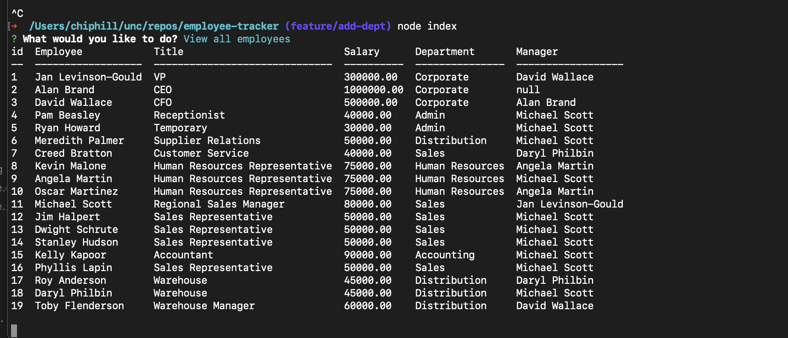

  
# Project Title - Employee-Tracker
  
  
## Project Description
Adds and modifies employees in a mysql database
  
## Table of Contents
  - [Installation](#installation)
  - [Usage](#usage)
  - [License](#license)
  - [Contributing](#contributing)
  - [Tests](#tests)
  - [Questions](#questions)
  
## Installation
clone the repo from the git hub account listed in this readme, and run npm i to install the dependencies.

### Setting up the sample database
got into the local repo at the root level.  
run `source db/db.sql  
run `source db/schema.sql  
run `source db/seeds.sql  
  
## Usage
From a terminal window, type index.js and you'll be greeted with a menu of choices.  Select the appropriate choice and follow the prompts.  

NOTE:  CURRENTLY THE FUNCTIONALITY IS FAILING.  When you select something from the menu, the query returns data but then the application just hangs up.  So you have to restart the application after every selection.

to start the application 
Node Index.js
after a query runs, click ctrl-c and restart the application and select your next query.

Images   
  

## Known issues
outstanding issues can be found here 
After a selection is run, the prompt never returns.  
Updating the employee is not working. 

other outstanding issues can be found here.
"https://github.com/roo116/employee-tracker/issues"
  
## License

  
## Contributing
Fix all the stuff that isn't working yet!!  That would be great.
  
## Tests
none
  
## Questions
If you have questions, reach out via email or GitHub  
Gitub:  [GitHub Repository](https//github.com/roo116)  
Email:  hillkarl03@gmail.com  
  